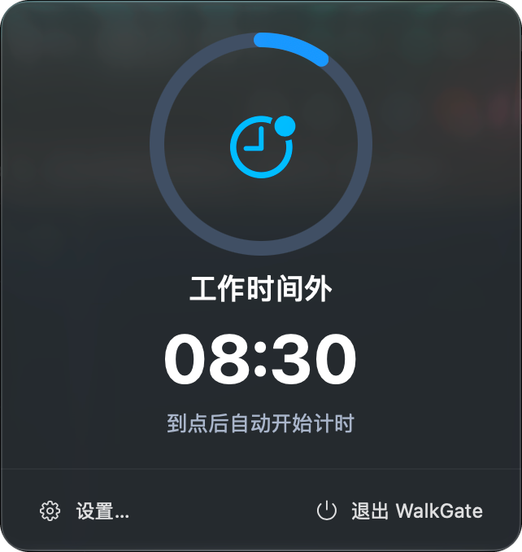

# WalkGate

[中文](README.md) | English

<p align="center">
  
</p>

A native, lightweight menu bar break reminder for macOS.

Plain countdown timers are easy to ignore. WalkGate opens a "break gate" at the end of each work session: a low-key card in the corner asks you to stand up and temporarily blocks desktop input. The break countdown starts the moment the card appears; once the minimum break is reached, extra break time keeps counting until you come back and manually start the next round.

> Current version: `0.3.5` · macOS 14 or later

## Screenshots

<p align="center">
  
  &nbsp;&nbsp;
  
</p>

<p align="center">
  
</p>

## Highlights

- **Menu bar resident**: see the remaining time and progress of the current round at any time, without a Dock icon.
- **Instant timing**: the break card starts counting down as soon as it appears, and keeps showing extra break time once the minimum is reached.
- **Low-interference break card**: the card stays in the bottom-right corner of the current screen, above the Dock — no jarring full-screen UI.
- **Restricted input during breaks**: all displays are covered and desktop clicks are intercepted, while the Dock stays visible so system emergency controls remain usable.
- **Manual resume**: the next round never starts by itself; click "Enter work mode" when you're back.
- **Reasonable exceptions**: each round can be deferred once, and an emergency skip is always available.
- **Meeting mode**: choose 30, 60, or 90 quiet minutes when you need uninterrupted focus.
- **Configurable work schedule**: set work start/end times and add lunch breaks or other rest periods; reminders pause during rest, and work restarts with a full session.
- **Sleep recovery**: if the Mac slept for at least the minimum break duration, waking up starts a full work cycle — no stand-up reminder the moment you open the lid.
- **Native system integration**: pre-break notifications, launch at login, and dark material effects that follow macOS.

## Workflow

```text
Work countdown
   ↓ time's up
Break gate (timing starts immediately)
   ↓ minimum break reached
Waiting for you to return
   ↓ click "Enter work mode"
A new work cycle begins
```

Defaults: 50-minute work, 5-minute break, 3-minute advance notice; default schedule: work 08:30–17:30 with a 12:00–13:30 lunch break. Rhythm, work hours, and any number of rest periods are adjustable in Settings and stored locally.

## Installation

Download [WalkGate-v0.3.5-macOS-Universal.dmg](https://github.com/AnonymXXX/walkgate/releases/download/v0.3.5/WalkGate-v0.3.5-macOS-Universal.dmg), open it and drag `WalkGate.app` to Applications. The package supports both Apple Silicon and Intel Macs.

### "Apple cannot verify" on first launch

<p align="center">
  
</p>

The current package is signed locally (no Apple Developer ID) and is not notarized, so the warning above may appear on first launch. Only continue if you are sure the package came from this repository:

1. In the dialog, click "Done" — do not click "Move to Trash".
2. Open System Settings → Privacy & Security.
3. Scroll down to "Security", find the blocked WalkGate and click "Open Anyway".
4. Confirm "Open" once more; after this one-time approval the app launches normally.

This is Apple's per-app security exception and does not disable Gatekeeper. See Apple's official guide: [Safely open apps on your Mac](https://support.apple.com/en-us/102445).

### Building from source

You can also build a locally signed version from source:

```bash
git clone https://github.com/AnonymXXX/walkgate.git
cd walkgate
./scripts/build-app.sh
open dist/WalkGate.app
```

`scripts/build-app.sh` signs with a certificate named `Local Mac App Code Signing` in your keychain; without it the script exits with `Signing identity not found`. Build with an ad-hoc signature instead:

```bash
LOCAL_APP_SIGNING_IDENTITY=- ./scripts/build-app.sh
```

To install into Applications:

```bash
ditto dist/WalkGate.app /Applications/WalkGate.app
open /Applications/WalkGate.app
```

macOS may ask for confirmation the first time you enable notifications or launch at login. Because this is a temporarily signed build, some system permissions may need to be re-approved after switching builds.

## Local development

### Requirements

- macOS 14 Sonoma or later
- Xcode 15 or later
- Swift 5.9 or later

Run directly:

```bash
swift run WalkGate
```

Run tests and a production build:

```bash
swift test
swift build -c release
```

Generate the `.app` bundle:

```bash
./scripts/build-app.sh release
```

The script produces a locally signed `dist/WalkGate.app` (no Apple Developer ID); the default signing certificate and configuration are described in "Building from source" above.

Build a Universal app for both Apple Silicon and Intel:

```bash
./scripts/build-app.sh release dist/WalkGate.app universal
```

## Project structure

```text
Sources/WalkGate/           SwiftUI and AppKit app layer
Sources/WalkGateCore/       testable session state machine plus panel positioning/refresh policy
Tests/WalkGateCoreTests/    core behavior tests
scripts/build-app.sh        local app bundling script
scripts/package-release.sh  release packaging script (zip and dmg)
```

WalkGate uses SwiftUI for the main panel and settings, and AppKit for the menu bar item, windows, and cross-display break cards. It has no third-party runtime dependencies.

## Data & privacy

WalkGate requires no account and uploads nothing. Rhythm settings and daily completed/skipped counts are stored locally in `UserDefaults` only. To tell whether you are back at your desk after a system wake, the app reads the macOS-provided keyboard/mouse idle time; it never records keystrokes, mouse content, or app content.

## Current limitations

- No formal signing, notarization, or automatic updates yet.
- Stats only show today's completed/skipped counts, with no history or trends.
- Remaining work/break time is not restored after quitting the app.
- The interface is currently available in Chinese only.
