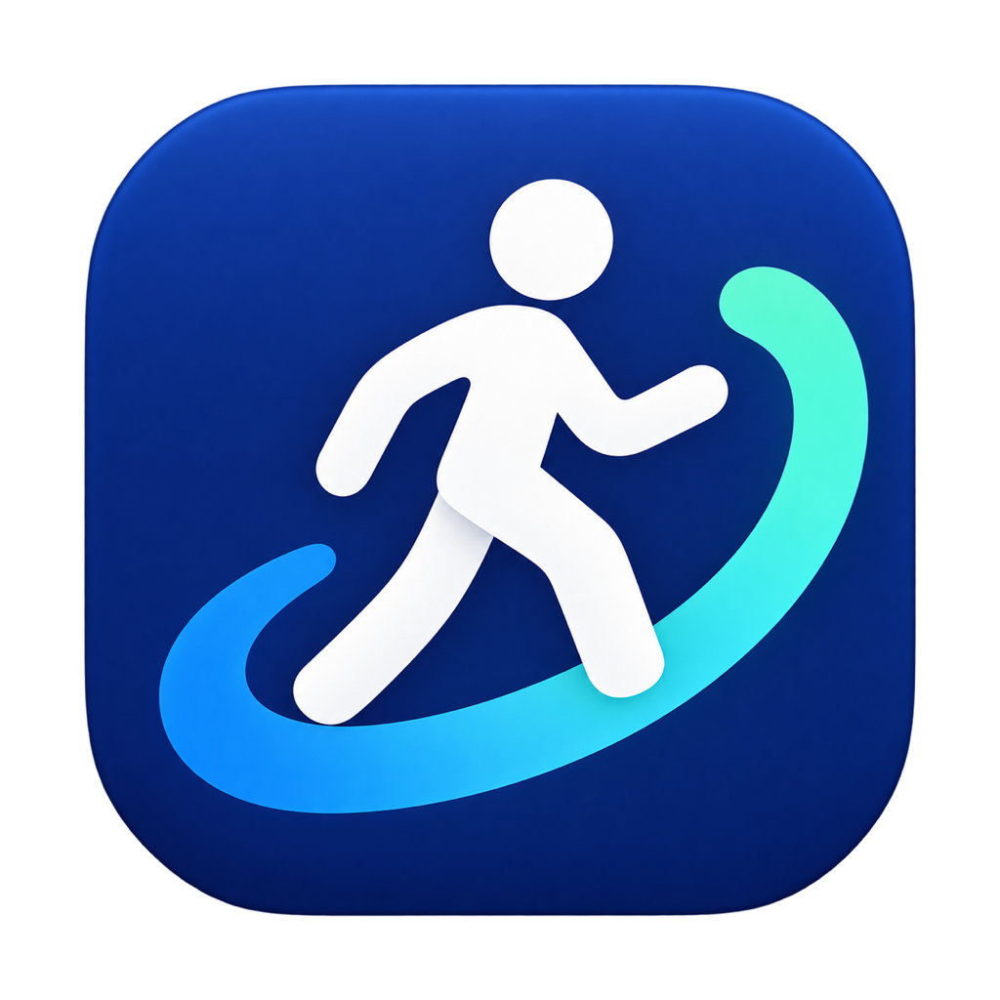
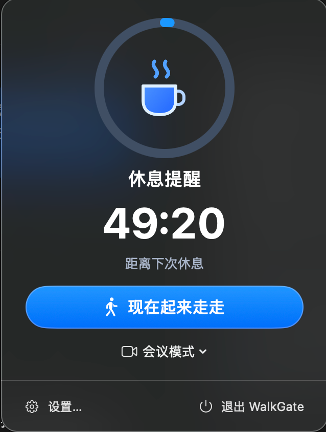
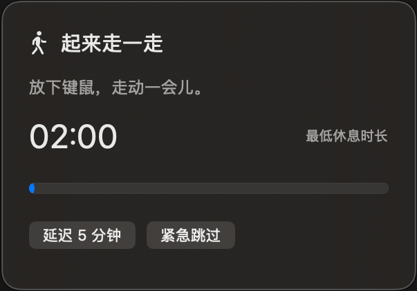
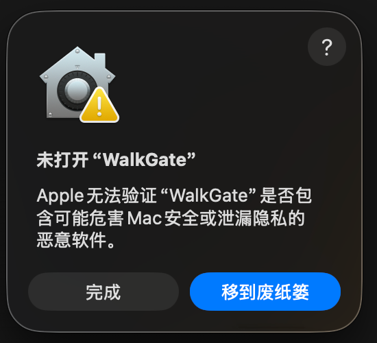

# WalkGate

<p align="center">
  
</p>

一款原生、轻量的 macOS 菜单栏久坐提醒工具。

普通倒计时很容易被忽略。WalkGate 会在工作周期结束后开启“休息闸门”：用低调的右下角卡片提示起身，并暂时拦截桌面操作。卡片弹出后立即开始休息倒计时；达到最低休息时长后继续记录额外休息时间，由你回来手动进入下一轮工作。

> 当前版本：`0.3.2` · 支持 macOS 14 及以上版本

## 界面预览

<p align="center">
  
  &nbsp;&nbsp;
  
</p>

## 核心体验

- **菜单栏常驻**：随时查看本轮剩余时间和进度，不占用 Dock 图标。
- **弹出立即计时**：休息卡片出现后立即倒计时，达标后继续显示额外休息时间。
- **低干扰休息卡片**：卡片显示在当前屏幕右下角、程序坞上方，不使用醒目的全屏界面。
- **休息操作限制**：休息期间覆盖所有显示器并拦截桌面点击；程序坞保持显示，系统应急能力仍可使用。
- **手动恢复工作**：达到最低休息时长后不会自行开始下一轮，回来点击“进入工作模式”才重新计时。
- **合理的例外**：每轮可延迟一次，也始终保留“紧急跳过”。
- **会议模式**：需要持续专注时，可选择安静 30、60 或 90 分钟。
- **可配置工作日程**：设置上下班时间，并添加午休、下午休息等多个时间段；休息期间暂停提醒，返回工作时自动从完整周期重新计时。
- **睡眠恢复**：Mac 睡眠时间达到最低休息时长后，唤醒并重新操作时会开启完整工作周期，避免刚开盖就弹出起身提醒。
- **原生系统集成**：支持提前通知、登录时自动启动，以及跟随 macOS 的深色材质效果。

## 工作流程

```text
工作倒计时
   ↓ 到期
休息闸门（弹出后立即计时）
   ↓ 达到最低休息时长
等待你回来
   ↓ 点击“进入工作模式”
开始新的工作周期
```

默认工作节奏为 50 分钟工作、5 分钟休息、提前 3 分钟提醒；默认日程为 08:30 上班、12:00–13:30 休息、17:30 下班。节奏、上下班时间和任意多个休息时段都可在设置中调整，并保存在本机。

## 安装

下载 [WalkGate-v0.3.2-macOS-Universal.dmg](https://github.com/AnonymXXX/walkgate/releases/download/v0.3.2/WalkGate-v0.3.2-macOS-Universal.dmg)，打开后将 `WalkGate.app` 拖入“应用程序”。该安装包同时支持 Apple Silicon 与 Intel Mac。

### 首次打开提示“Apple 无法验证”

<p align="center">
  
</p>

当前安装包采用 ad-hoc 签名，尚未经过 Apple Developer ID 公证，因此首次打开时可能出现上图提示。请仅在确认安装包来自本仓库时继续：

1. 在提示中点击“完成”，不要点击“移到废纸篓”。
2. 打开“系统设置”→“隐私与安全性”。
3. 向下滚动到“安全性”，找到被拦截的 WalkGate，点击“仍要打开”。
4. 再次确认“打开”；完成一次授权后，后续可正常启动。

这是 Apple 提供的单个 App 安全例外，不需要关闭系统“门禁”。详见 [Apple 官方说明：在 Mac 上安全地打开 App](https://support.apple.com/zh-cn/102445)。

### 从源码构建

也可以从源码构建本机临时签名版本：

```bash
git clone https://github.com/AnonymXXX/walkgate.git
cd walkgate
./scripts/build-app.sh
open dist/WalkGate.app
```

如需安装到“应用程序”目录：

```bash
ditto dist/WalkGate.app /Applications/WalkGate.app
open /Applications/WalkGate.app
```

首次启用通知或登录启动时，macOS 可能要求确认。由于当前是临时签名构建，更换构建版本后，部分系统授权可能需要重新确认。

## 本地开发

### 环境要求

- macOS 14 Sonoma 或更高版本
- Xcode 15 或更高版本
- Swift 5.9 或更高版本

直接运行：

```bash
swift run WalkGate
```

运行测试与生产构建：

```bash
swift test
swift build -c release
```

生成 `.app`：

```bash
./scripts/build-app.sh release
```

构建脚本会生成经过 ad-hoc 签名的 `dist/WalkGate.app`。

生成同时支持 Apple Silicon 与 Intel 的 Universal App：

```bash
./scripts/build-app.sh release dist/WalkGate.app universal
```

## 项目结构

```text
Sources/WalkGate/          SwiftUI 与 AppKit 应用层
Sources/WalkGateCore/      可测试的计时状态机
Tests/WalkGateCoreTests/   核心行为测试
scripts/build-app.sh       本地应用打包脚本
```

WalkGate 使用 SwiftUI 构建菜单栏和设置界面，并用 AppKit 管理跨显示器的休息窗口。项目不依赖第三方运行时库。

## 数据与隐私

WalkGate 不需要账户，也不会上传使用数据。节奏设置和每日完成/跳过次数仅保存在本机 `UserDefaults` 中。为判断系统唤醒后是否已经回到工位，应用会读取 macOS 提供的键鼠空闲时长，但不会记录按键、鼠标内容或应用内容。

## 当前限制

- 尚未提供正式签名、公证和自动更新。
- 当前统计仅展示当天完成与跳过次数，不提供历史趋势。
- 工作或休息中的剩余时间不会在应用退出后恢复。
